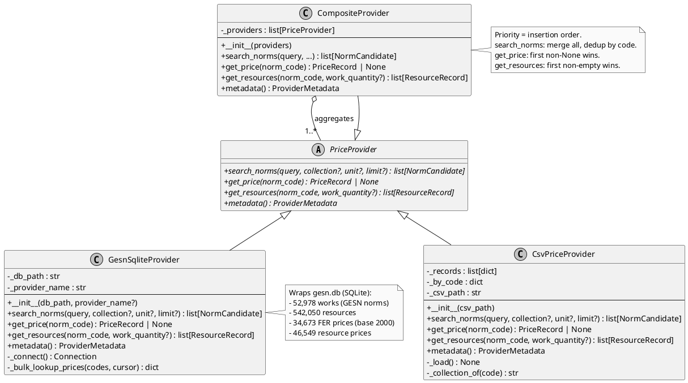
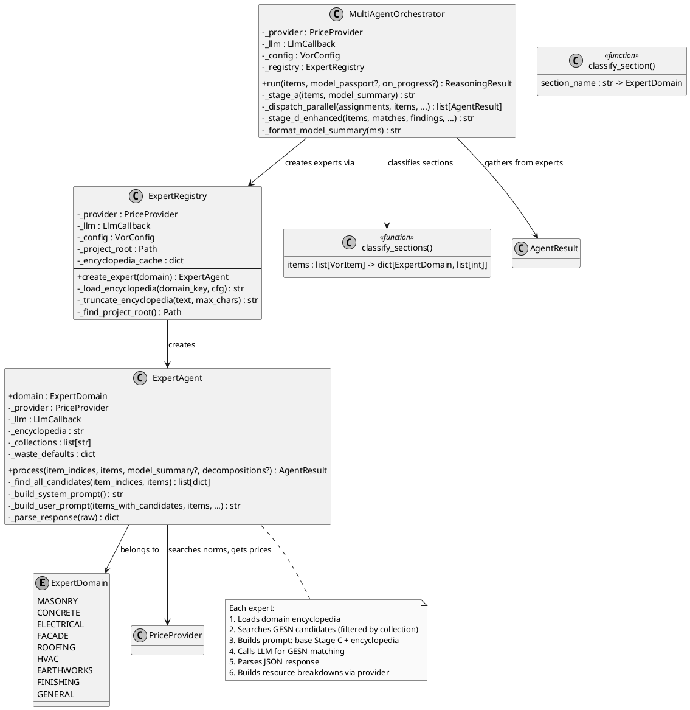
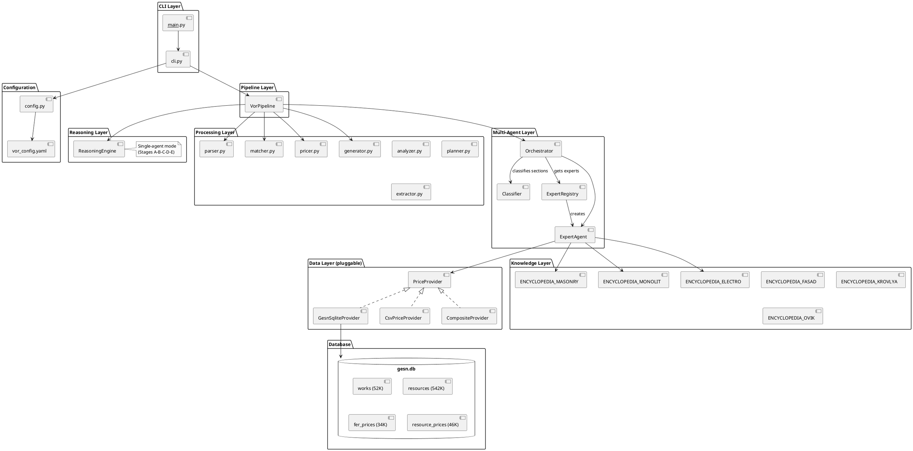
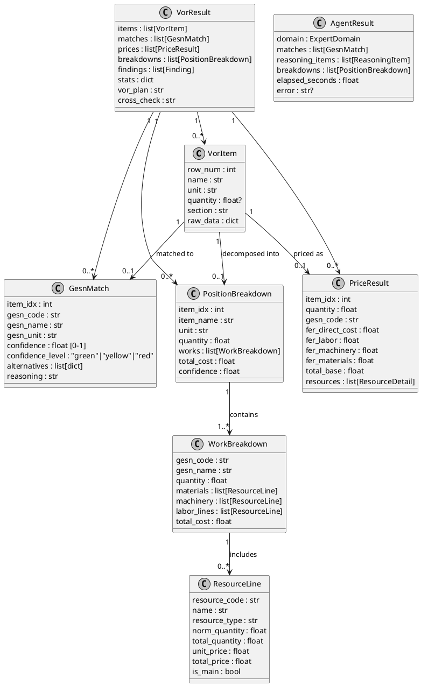
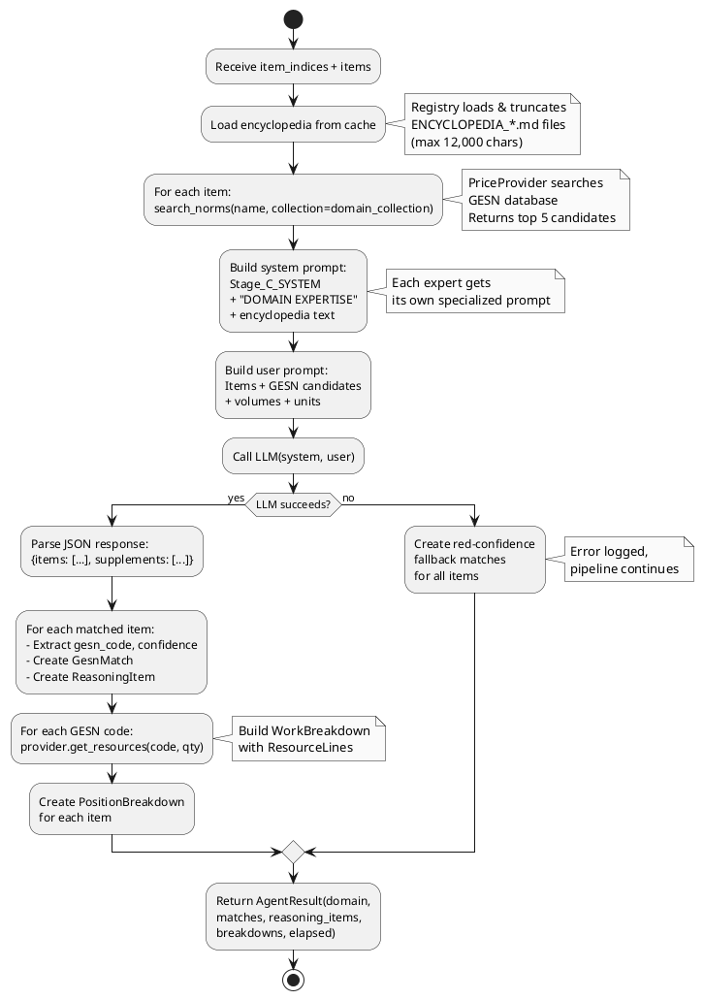
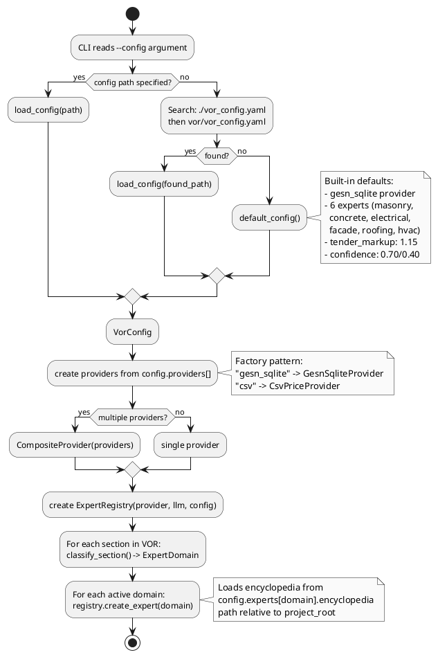

# VOR Multi-Agent Pricing System - Architecture

## 1. Общая схема системы

```
                            VOR.xlsx (вход)
                                 |
                            [cli.py]
                            argparse + LLM setup
                                 |
                         ========|========
                         |  VorPipeline  |
                         |  pipeline.py  |
                         =================
                           /     |     \
                      MVP    Smart   Multi-Agent
                      run()  run_smart() run_multiagent()
                          \    |    /
                           \   |   /
                            \  |  /
                    +--------+-+--+---------+
                    |                        |
               [parser.py]           [analyzer.py]
               parse_vor_excel()     analyze_model_passport()
                    |                detect_multi_layer_walls()
                    |                detect_implicit_work()
                    v                        |
               VorItem[]                ModelSummary
                    |                   Findings
                    |                        |
                    +--------+---------------+
                             |
                    +--------+--------+
                    |                 |
              [MVP path]    [Multi-Agent path]
                    |                 |
             [matcher.py]    [orchestrator.py]
             match_gesn()    MultiAgentOrchestrator
                    |                 |
                    |         +-------+-------+
                    |         |               |
                    |    [Stage A]      [Classifier]
                    |    LLM: "Understand"  classify_sections()
                    |         |               |
                    |         |     {domain: [indices]}
                    |         |               |
                    |         +-------+-------+
                    |                 |
                    |    ============ | =============
                    |    | asyncio.gather (parallel) |
                    |    |                           |
                    |    | [Expert]  [Expert] [Expert]|
                    |    | masonry   concrete  facade |
                    |    | +encycl.  +encycl. +encycl.|
                    |    | +provider +provider+provider|
                    |    | +LLM     +LLM     +LLM    |
                    |    |    |         |        |    |
                    |    | AgentResult  AR      AR   |
                    |    ============================
                    |                 |
                    |           [Merge Results]
                    |           sort by item_idx
                    |                 |
                    |           [Stage D]
                    |           LLM: cross-check
                    |                 |
                    +--------+--------+
                             |
                      ReasoningResult / GesnMatch[]
                             |
                        [pricer.py]
                        calculate_prices()
                        FER lookup + resources
                             |
                        PriceResult[]
                             |
                        [generator.py]
                        generate_vor_excel_v3()
                             |
                      Priced VOR.xlsx (выход)
```

---

## 2. UML Class Diagram - Providers (pluggable data sources)



---

## 3. UML Class Diagram - Multi-Agent System



---

## 4. Sequence Diagram - Multi-Agent Pipeline

```plantuml
@startuml multiagent_sequence

skinparam monochrome true

actor "User" as user
participant "CLI" as cli
participant "VorPipeline" as pipe
participant "Parser" as parser
participant "Analyzer" as analyzer
participant "Orchestrator" as orch
participant "Classifier" as cls
participant "Registry" as reg
participant "Expert\n(masonry)" as exp1
participant "Expert\n(concrete)" as exp2
participant "Expert\n(facade)" as exp3
participant "LLM" as llm
participant "Provider\n(gesn.db)" as prov
participant "Pricer" as pricer
participant "Generator" as gen

user -> cli: python -m vor.cli vor.xlsx
activate cli

cli -> pipe: run_multiagent(file_bytes, provider, llm_callback, config)
activate pipe

== 1. Parsing ==

pipe -> parser: parse_vor_excel(file_bytes)
parser --> pipe: items[20]

== 2. Pre-Analysis (deterministic) ==

pipe -> orch: run(items, model_passport, on_progress)
activate orch

orch -> analyzer: analyze_model_passport()
analyzer --> orch: ModelSummary

orch -> analyzer: detect_multi_layer_walls()
analyzer --> orch: decompositions[]

orch -> analyzer: detect_implicit_work()
analyzer --> orch: implicit_findings[]

== 3. Stage A: Understand VOR (1 LLM call) ==

orch -> llm: STAGE_A_SYSTEM + VOR summary
llm --> orch: vor_plan (Markdown)

== 4. Classification (deterministic) ==

orch -> cls: classify_sections(items)
cls --> orch: {masonry: [6,7,8,9], concrete: [3,4,5,10,11,12], facade: [15,16], ...}

== 5. Parallel Expert Dispatch ==

orch -> reg: create_expert(MASONRY)
reg --> orch: expert1

orch -> reg: create_expert(CONCRETE)
reg --> orch: expert2

orch -> reg: create_expert(FACADE)
reg --> orch: expert3

par asyncio.gather
  orch -> exp1: process([6,7,8,9], items)
  activate exp1
  exp1 -> prov: search_norms("кладка стен", collection="08")
  prov --> exp1: NormCandidate[]
  exp1 -> llm: Stage_C + ENCYCLOPEDIA_MASONRY + candidates
  llm --> exp1: JSON {items, supplements}
  exp1 -> prov: get_resources("08-02-001-01", qty=245)
  prov --> exp1: ResourceRecord[]
  exp1 --> orch: AgentResult(masonry)
  deactivate exp1
and
  orch -> exp2: process([3,4,5,10,11,12], items)
  activate exp2
  exp2 -> prov: search_norms("монолит фундамент", collection="06")
  prov --> exp2: NormCandidate[]
  exp2 -> llm: Stage_C + ENCYCLOPEDIA_MONOLIT + candidates
  llm --> exp2: JSON {items, supplements}
  exp2 --> orch: AgentResult(concrete)
  deactivate exp2
and
  orch -> exp3: process([15,16], items)
  activate exp3
  exp3 -> prov: search_norms("утепление фасад", collection="26")
  prov --> exp3: NormCandidate[]
  exp3 -> llm: Stage_C + ENCYCLOPEDIA_FASAD + candidates
  llm --> exp3: JSON {items, supplements}
  exp3 --> orch: AgentResult(facade)
  deactivate exp3
end

== 6. Merge & Cross-check ==

orch -> orch: _merge_results(sort by item_idx)
orch -> analyzer: detect_unit_mismatches(items, matches)

orch -> llm: STAGE_D_SYSTEM + summary + expert provenance
llm --> orch: cross_check (Markdown)

orch --> pipe: ReasoningResult
deactivate orch

== 7. Pricing ==

pipe -> pricer: calculate_prices(matches, quantities)
pricer --> pipe: PriceResult[]

== 8. Excel Generation ==

pipe -> gen: generate_vor_excel_v3(result)
gen --> pipe: excel_bytes

pipe --> cli: VorResult
deactivate pipe

cli -> user: Priced_VOR.xlsx
cli -> user: Stats: 20 items, 7 green, 10 yellow, 3 red
deactivate cli

@enduml
```

---

## 5. Component Diagram - System Layers



---

## 6. Data Model Diagram



---

## 7. Expert Agent Internal Flow



---

## 8. Configuration Flow



---

## 9. Scalability Points

```
+---------------------------------------------+
|          HOW TO EXTEND THE SYSTEM            |
+---------------------------------------------+
|                                              |
|  NEW PRICE SOURCE:                           |
|  1. Implement PriceProvider ABC              |
|  2. Add to vor_config.yaml:                  |
|     providers:                               |
|       - type: my_source                      |
|         path: data/prices.db                 |
|  3. Register in config.py factory            |
|  4. Done. Zero engine changes.               |
|                                              |
+---------------------------------------------+
|                                              |
|  NEW EXPERT DOMAIN:                          |
|  1. Write ENCYCLOPEDIA_MY.md                 |
|  2. Add to vor_config.yaml:                  |
|     experts:                                 |
|       my_domain:                             |
|         collections: ["XX"]                  |
|         keywords: ["keyword1"]               |
|         encyclopedia: skills/my/ENC.md       |
|  3. Done. Zero code changes.                 |
|                                              |
+---------------------------------------------+
|                                              |
|  UPDATE PRICES:                              |
|  1. Replace CSV/DB file                      |
|  2. Or add as new provider                   |
|     (CompositeProvider handles priority)      |
|  3. Restart CLI                              |
|                                              |
+---------------------------------------------+
```

---

## 10. File Map

```
vor/
|
|-- models.py              Data models (VorItem, GesnMatch, ExpertDomain, AgentResult, ...)
|-- pipeline.py            VorPipeline (run, run_smart, run_multiagent)
|-- parser.py              Excel VOR parser
|-- matcher.py             Deterministic GESN matching
|-- analyzer.py            Model intelligence (multi-layer, implicit work, waste)
|-- pricer.py              FER price lookup + resource breakdown
|-- generator.py           Excel output (v2: 4 sheets, v3: nested)
|-- reasoning.py           ReasoningEngine (4-stage LLM) + public helpers
|-- reporter.py            Markdown report generation
|-- planner.py             Revit extraction planning
|-- extractor.py           C# code generation for Revit
|-- config.py              VorConfig + load_config + factory
|-- vor_config.yaml        Default configuration
|-- cli.py                 CLI entry point
|-- __main__.py            python -m vor
|
|-- providers/
|   |-- base.py            PriceProvider ABC + data classes
|   |-- gesn_sqlite.py     GESN/FER SQLite provider
|   |-- csv_provider.py    CSV price provider
|   |-- composite.py       Multi-source combinator
|
|-- agents/
|   |-- classifier.py      Section -> ExpertDomain mapping
|   |-- expert.py          ExpertAgent (LLM + encyclopedia)
|   |-- registry.py        Expert factory + encyclopedia loader
|   |-- orchestrator.py    Multi-agent coordinator (parallel dispatch)
|
tests/test_vor/
|-- test_analyzer.py       41 tests
|-- test_classifier.py     20 tests
|-- test_cli.py            5 tests
|-- test_config.py         16 tests
|-- test_csv_provider.py   17 tests
|-- test_expert.py         13 tests
|-- test_extractor.py      14 tests
|-- test_generator.py      20 tests
|-- test_integration.py    18 tests
|-- test_matcher.py        20 tests
|-- test_orchestrator.py   14 tests
|-- test_parser.py         8 tests
|-- test_pipeline.py       28 tests
|-- test_planner.py        19 tests
|-- test_pricer.py         19 tests
|-- test_providers.py      22 tests
|-- test_reasoning.py      23 tests
|-- test_reporter.py       23 tests
|                          ----
|                          372 total tests
|-- fixtures/
    |-- test_vor_multi_section.xlsx
```
